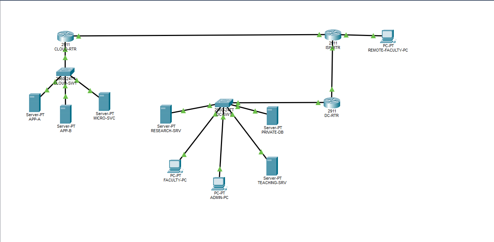
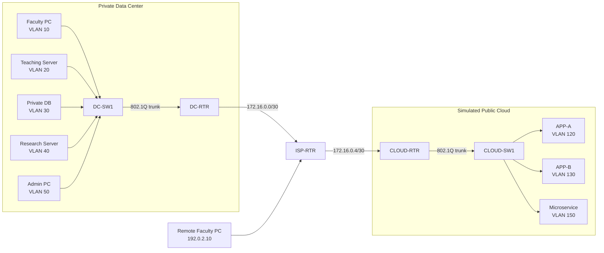

# Secure Hybrid Data Center Security Architecture


A Cisco Packet Tracer cybersecurity project that connects a segmented private data center to a simulated public-cloud environment while enforcing least privilege, restricted administration, remote-faculty access, and lateral-movement containment.



> **Important:** Packet Tracer implements the VLANs, routing, ACLs, HTTP services, local accounts, and SSH used in this project. Cloud VPCs, Security Groups, IAM, Kubernetes, and remote-access VPN are represented conceptually and are not claimed as native Packet Tracer services.

## Architecture



### Corrected physical port map

| From | To | Purpose |
|---|---|---|
| `DC-RTR G0/0` | `DC-SW1 Gi0/1` | Private-DC VLAN trunk |
| `DC-RTR G0/1` | `ISP-RTR G0/0` | Private-DC WAN link |
| `CLOUD-RTR G0/0` | `ISP-RTR G0/1` | Cloud WAN link |
| `CLOUD-RTR G0/1` | `CLOUD-SW1 Gi0/1` | Cloud VLAN trunk |
| `REMOTE-FACULTY-PC Fa0` | `ISP-RTR G0/2` | External faculty network |

## Security zones

| VLAN | Zone | Network | Gateway |
|---:|---|---|---|
| 10 | Faculty | `10.10.10.0/24` | `10.10.10.1` |
| 20 | Teaching service | `10.10.20.0/24` | `10.10.20.1` |
| 30 | Private database | `10.10.30.0/24` | `10.10.30.1` |
| 40 | Research | `10.10.40.0/24` | `10.10.40.1` |
| 50 | DC management | `10.10.50.0/24` | `10.10.50.1` |
| 120 | Application A | `10.20.20.0/24` | `10.20.20.1` |
| 130 | Application B | `10.20.30.0/24` | `10.20.30.1` |
| 150 | Microservice | `10.20.50.0/24` | `10.20.50.1` |
| 160 | Cloud management | `10.20.60.0/24` | `10.20.60.1` |

## Implemented controls

- VLAN-based network segmentation
- 802.1Q trunks and router-on-a-stick
- Separate IP subnets and default gateways
- Static routing between private DC, transit, remote user, and simulated cloud
- Source-facing extended ACLs using explicit least-privilege rules
- Local administrative identity and privilege level
- SSH version 2 with RSA keys
- VTY access restricted to the management subnet
- HTTP teaching and backend microservice demonstrations
- Pre-security and post-security verification matrices

## Main security demonstration

Application A is **assumed compromised**. No exploit is performed.

| Test | Expected result | Security objective |
|---|---|---|
| APP-A → required microservice | Allowed | Preserve the required dependency |
| APP-A → APP-B | Blocked | Stop application lateral movement |
| APP-A → cloud management | Blocked | Protect administration |
| APP-A → private database | Blocked | Protect private data across the hybrid link |
| APP-A → research | Blocked | Protect enterprise systems |

The result demonstrates reduced lateral movement and a smaller blast radius after compromise.

## Faculty and administrative tests

| Test | Expected result |
|---|---|
| Faculty → teaching webpage | Allowed |
| Faculty → private database | Blocked |
| Faculty → router SSH | Blocked |
| Admin PC → router SSH | Allowed |
| Remote faculty → teaching webpage | Allowed |
| Remote faculty → private database | Blocked |

## Repository contents

```text
packet-tracer/    Final .pkt simulation file
configurations/   Sanitized Cisco IOS configurations
documentation/    Learning and build documentation
screenshots/      Configuration and test evidence
video/            Demonstration-video link placeholder
```

## Open the project

1. Install Cisco Packet Tracer.
2. Download `packet-tracer/Secure-Hybrid-Data-Center.pkt` after it has been added.
3. Open the file in Packet Tracer.
4. Use Realtime mode for normal testing.
5. Refer to `documentation/` for the build and learning guides.

## Verification commands

```text
show vlan brief
show interfaces trunk
show ip interface brief
show ip route
show access-lists
show ip ssh
```

## Evidence gallery

- [DC VLAN configuration](screenshots/02-dc-vlans.png)
- [DC 802.1Q trunk](screenshots/03-dc-trunk.png)
- [Cloud VLAN configuration](screenshots/04-cloud-vlans.png)
- [Cloud 802.1Q trunk](screenshots/05-cloud-trunk.png)
- [DC router interfaces](screenshots/06-dc-router-interfaces.png)
- [Cloud router interfaces](screenshots/07-cloud-router-interfaces.png)
- [DC routing table](screenshots/08-dc-routing-table.png)
- [ISP routing table](screenshots/09-isp-routing-table.png)
- [Authorized admin SSH](screenshots/10-admin-ssh-success.png)
- [Faculty teaching access allowed](screenshots/11-faculty-teaching-allowed.png)
- [Faculty database access blocked](screenshots/12-faculty-database-blocked.png)
- [Remote faculty access allowed](screenshots/14-remote-faculty-allowed.png)
- [App-A backend access allowed](screenshots/16-app-a-backend-allowed.png)
- [App-A to App-B blocked](screenshots/17-app-a-to-app-b-blocked.png)
- [App-A ACL counters](screenshots/22-app-a-acl-counters.png)

## Implemented vs. simulated

| Category | Features |
|---|---|
| Implemented | VLANs, trunks, subinterfaces, routing, ACLs, HTTP, local users, SSH |
| Simulated | Public cloud, VPC-style zones, Security Group intent, Kubernetes microservice, remote faculty |
| Production equivalent | Firewalls, redundant links, private/IPsec connectivity, centralized IAM/AAA with MFA, SIEM, real cloud and Kubernetes controls |

## Troubleshooting lessons

- A configured trunk does not appear in `show interfaces trunk` until both ends are connected and operational.
- `up/down` commonly means the local interface is enabled but the far end or line protocol is not ready.
- Initial ping loss can occur while Packet Tracer learns ARP information.
- A failed ping does not automatically prove an ACL block; routes, addressing, links, and services must be checked first.
- IOS command syntax varies: this Packet Tracer router generated RSA keys interactively with `crypto key generate rsa`, followed by a modulus prompt.

## Security notice

The credentials in the original classroom simulation are demonstration-only. The configuration files in this repository use placeholders. Never reuse classroom passwords in real systems.

## Future improvements

- Dedicated stateful firewalls
- Redundant routers, switches, and links
- IPsec VPN or private hybrid connectivity
- Authenticated remote-access VPN or ZTNA
- Centralized RADIUS/TACACS+ with MFA
- Syslog/SIEM monitoring
- Real cloud VPCs and stateful Security Groups
- Real Kubernetes namespaces, identities, secrets, and NetworkPolicies

## Author

Created as part of the Cisco Virtual Internship 2026 Cyber Security project.
